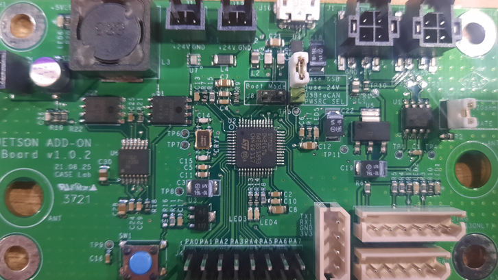
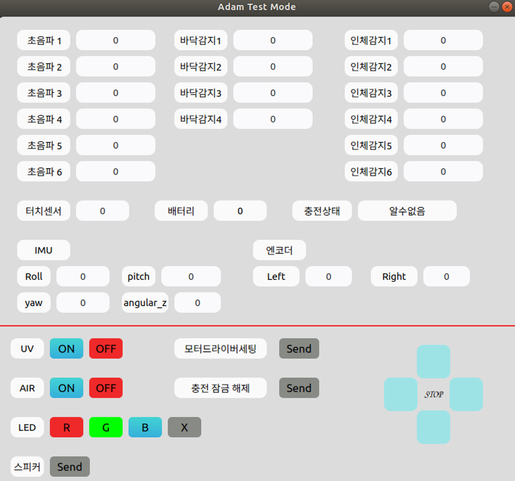
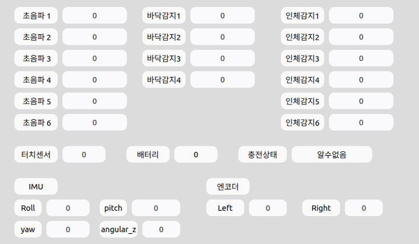
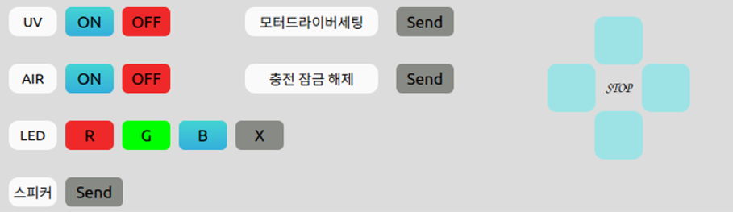

# UVBOT TEST UI

## 환경 구축
우분투 18.04 LTS 기준
1. 터미널 창을 연다.
2. 다음과 명령어를 순서대로 입력한다.

    & sudo apt-get install can-utils 
    & pip3 install cantools 
    & pip3 install pyside2 

이미 설치된 경우 설치하지 않아도 됩니다. 
터미널 여는 방법 ctrl+alt+t

## UI 실행하는 방법
 
1. 위 사진의 점퍼핀(흰색)과 같은 위치에 점퍼핀을 꼽는다.
2. 위 사진의 can 통신 모듈을 컴퓨터에 꼽는다.
3. can 모듈과 로봇을 연결한다.
4. 터미널을 열어 다음과 같이 실행한다. 
    $ cd Adam_test_ui/shell 
    $ sudo ./adam_ui.sh 

주의사항
- cd Adam_test_ui/shell이 안될경우 cd 입력후 다시 시도
- sudo ./adam_ui.sh이 실행되지 않을 경우 " chmod +x * "을 입력
- can 모듈을 꼽지않고 실행 할 경우 실해되지 않습니다.
- can 통신이 안될경우 UI가 정상 동작하지 않을 수 있습니다.
- can 통신이 안될경우 UI가 정상 종료 되지 않을 수 있습니다.
- UI가 정상 동작하지 않을 경우 실행한 터미널에 ctrl+c를 누른후 종료하면 종료됩니다.

## UI 사용법
전체 UI 모습 
   
센서 데이터 확인창  
 
로봇의 센서 데이터를 확인 할 수 있는 부분    

명령 전송 버튼 창 
 
버튼을 이용해 로봇에 명령을 줄수 있는 부분    
- UV : 적외선 램프와 블라인드 on/off
- AIR: 공기 청정기 on/off (공기청정 팬은 40% 출력으로 동작)
- LED: 로봇 사이드에 있는 LED on/off R:빨강 G:초록 B:파랑 
- 스피커 : TTS (안녕하세요 아담입니다.)
- 충전잠금 해제 : 충전스테이션이 없는 경우에 로봇의 잠금을 해제하는 버튼
- 모터드라이버셋팅 : 모터드라이버를 셋팅하는 버튼 
    - 사용법
        1. can모듈과 모터드라이버를 연결한다. (랜선 이용)
        2. 버튼을 누른다.
        3. 1분정도 소요되므로 충분히 기다린다.
  
- 조이스틱 : 모터 테스트용 50RPM으로 앞뒤좌우 정지 동작 가능
  

