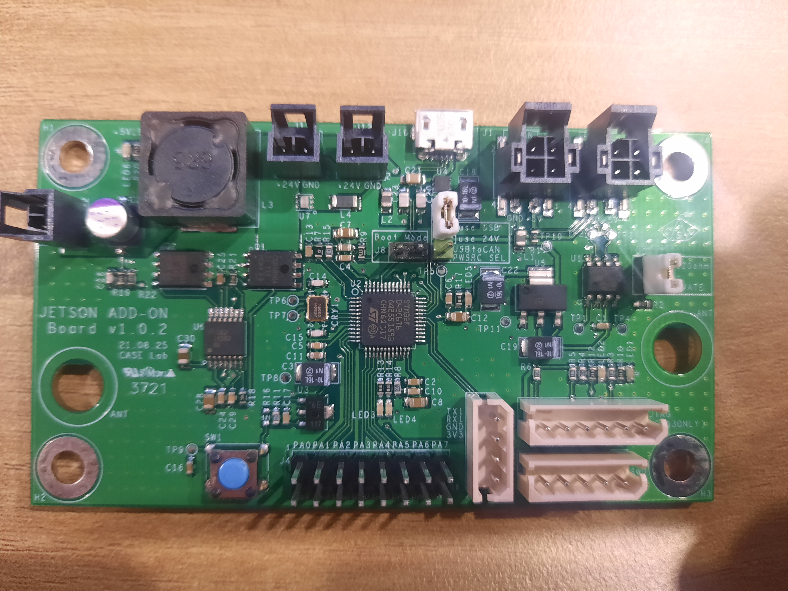

# UVBOT TEST UI

## 환경 구축
우분투 18.04 LTS 기준
1. 터미널 창을 연다.
2. 다음과 명령어를 순서대로 입력한다.

    & sudo apt-get install can-utils
    & pip3 install cantools
    & pip3 install pyside2

이미 설치된 경우 설치하지 않아도 됩니다. 
터미널 여는 방법 ctrl+alt+t

## UI 실행하는 방법
 
1. 위 사진의 점퍼핀(흰색)과 같은 위치에 점퍼핀을 꼽는다.
2. 위 사진의 can 통신 모듈을 컴퓨터에 꼽는다.
3. 터미널을 열어 다음과 같이 실행한다.
    $ cd Adam_test_ui/shell
    $ sudo ./adam_ui.sh

주의사항
- cd cd Adam_test_ui/shell이 안될경우 cd 입력후 다시 시도
- sudo ./adam_ui.sh이 실행되지 않을 경우 chmod +x *을 입력
- can 모듈을 꼽지않고 실행 할 경우 실해되지 않습니다.
- can 통신이 안될경우 UI가 정상 동작하지 않을 수 있습니다.
- can 통신이 안될경우 UI가 정상 종료 되지 않을 수 있습니다.
- UI가 정상 동작하지 않을 경우 실행한 터미널에 ctrl+c를 누른후 종료하면 종료됩니다.

